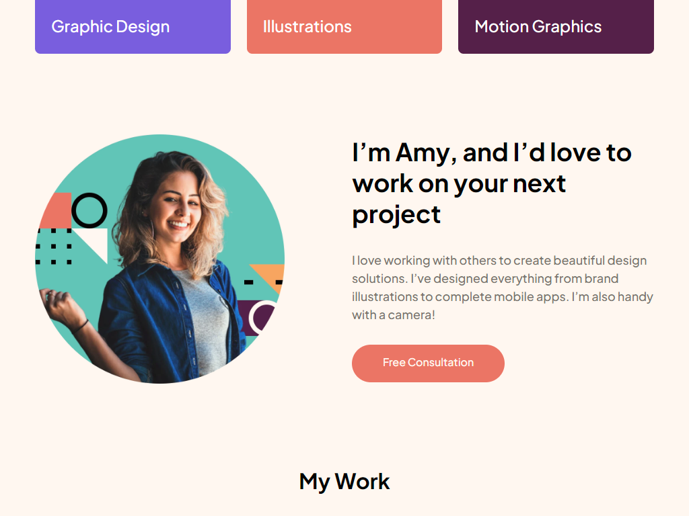

# Frontend Mentor - Single-page design portfolio solution

This is a solution to the [Single-page design portfolio challenge on Frontend Mentor](https://www.frontendmentor.io/challenges/singlepage-design-portfolio-2MMhyhfKVo). Frontend Mentor challenges help you improve your coding skills by building realistic projects.

## Table of contents

- [Overview](#overview)
  - [The challenge](#the-challenge)
  - [Screenshot](#screenshot)
  - [Links](#links)
- [My process](#my-process)
  - [Built with](#built-with)
  - [What I learned](#what-i-learned)
  - [Useful resources](#useful-resources)
- [Author](#author)

**Note: Delete this note and update the table of contents based on what sections you keep.**

## Overview

### The challenge

Users should be able to:

- View the optimal layout for the site depending on their device's screen size
- See hover states for all interactive elements on the page
- Navigate the slider using either their mouse/trackpad or keyboard

### Screenshot



Add a screenshot of your solution. The easiest way to do this is to use Firefox to view your project, right-click the page and select "Take a Screenshot". You can choose either a full-height screenshot or a cropped one based on how long the page is. If it's very long, it might be best to crop it.

Alternatively, you can use a tool like [FireShot](https://getfireshot.com/) to take the screenshot. FireShot has a free option, so you don't need to purchase it.

Then crop/optimize/edit your image however you like, add it to your project, and update the file path in the image above.

**Note: Delete this note and the paragraphs above when you add your screenshot. If you prefer not to add a screenshot, feel free to remove this entire section.**

### Links

- Solution URL: [https://github.com/miranlegin/fem-single-page-design-portfolio](https://github.com/miranlegin/fem-single-page-design-portfolio)
- Frontend Mentor URL: [https://www.frontendmentor.io/solutions/fun-exercise-with-grid-Kz0LIdzqa-](https://www.frontendmentor.io/solutions/fun-exercise-with-grid-Kz0LIdzqa-)
- Live Site URL: [Add live site URL here](https://your-live-site-url.com)

## My process

### Built with

I decided to tackle this challenge after I've seen some not so good attempts and thinking to myself that i would probably make a better job.

This layout has 2 main features which are somehow complicated to create. First is the grid section which on the first look doesn't seem like a challenge, and the second is slider component.

I promised myself that i would not use external plugins for simple tasks like sliders/carousels/tabs etc so i can practice more.

After some basic layout styling I decided to give a go at grid section first. And then the fun begins. Firstly i thought that it would be easy challenge but later i found out that Illustrations / Photography items are switching places and i swirled into a spiral of bad choices. Things are not working like i was expecting so i started to do other sections just to clear my thoughts a bit. I've wanted to create a grid in which the auto layout would do it's magic and i didn't need to depend on @media queries for the layout shifts. Lastly i've made a compromise and created additional layout which is far from perfect but at least whole things is working like expected. If populating data from CMS of API would become a problem i would revert to old solution with compromising on desing a bit.

Other component was slider and my initial reaction was to create something with minimal markup that i can extend later if necessary. First there was a problem that this component is overflowing the body on the sides. After some initial thought i decided to give it a go and see where it would lead me. There was some calculations needed to be made in the progress and on second attempt i have succeded. Added some animations for the sliding effect and job was done.

Other sections were smooth sailing and i only needed to add a couple of breakpoints for small layout shifts. Could have been probably make it without but i've had enough of this challenge for now.

### What I learned

Being more and more comfortable with Grid i've learned a valuable lesson. That is to layout the grid on the paper first and to really be able to understand which piece belongs to which grid space and to try to visualize how this can be achived before writing any code.

I would be really grateful if someone would found a workaround on this markup, because it is somewhat limiting

```html
<div class="grid-double">
  <div class="item" style="--item-bg: var(--summer-yellow)">
    
    UI/UX
  </div>
  ...
</div>
```

This can become handly in laying out other challenges because all project here on the platform are following the same basic container width

```css
/* viewport width when max width is met 1238px */
--site-width: 69.375rem;
--max-margin: 4rem;
```

This is really helpful when button needs to be block but without need to be 100% wide

```css
.btn {
  width: max-content;
}
```

Vertical button alignment from this blog: https://ishadeed.com/article/button-label-alignment/

```css
.btn::after {
  content: '';
  display: inline-block;
  height: 1.75em;
  vertical-align: middle;
}
```

This one worked for me but i would really like to know which is the best practice to setup minmax values

```css
/* 8.25 rem is minimal width od 320px viewport */
grid-template-columns: repeat(auto-fit, minmax(min(18rem, 100%), 1fr));
```

These values for slider translation are just for this project, if i would create a plugin from this project i would leave this bit in a Javascript to be able to have as many items as i need and calculate this offset in Javascript alone, this is definitely not the best practice

```css
.slider[data-active='1'] .slider-inner {
  translate: -10%;
}
```

### Useful resources

- [Align text vertically in the middle of the button](https://ishadeed.com/article/button-label-alignment/) - Sometimes a can see that the vertical alignment on an element is slightly off and this is one of the solutions for it
- [Example resource 2](https://www.example.com) - This is an amazing article which helped me finally understand XYZ. I'd recommend it to anyone still learning this concept.

## Author

- Frontend Mentor - [@miranlegin](https://www.frontendmentor.io/profile/miranlegin)
